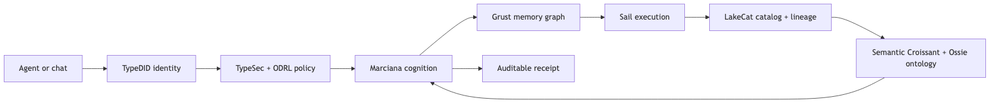

# Marciana 2: cognition is a governed semantic layer


Marciana 2 is the release in which Marciana stops being a memory feature
waiting to be attached to an agent and becomes what memory is in practice: the
organizing semantic layer between an agent's changing context and the evidence
an enterprise must be able to audit.

AI memory is now a commodity. Every serious agentic platform, chat product, and
assistant ships some form of conversation history, profile, retrieval, or
long-term memory. That means memory is not a separate product category an
enterprise should procure merely to give an agent a place to put facts. The
hard question is different: can the system organize facts, infer across short,
working, and durable horizons, and still show exactly what it knew, why it
used it, who was allowed to see it, and how to correct or forget it?

Marciana 2 is our answer: cognition may be ambitious; the evidence boundary
must remain conservative.

## What ships in Marciana 2

The release brings together the pieces that make cognition operational rather
than rhetorical:

- governed `remember`, `recall`, `improve`, and `forget` verbs over Grust;
- TypeDID identity and TypeSec capability checks at every protected boundary;
- ODRL-aligned purpose, retention, sensitivity, quarantine, and deletion
  semantics;
- semantic and neighborhood recall across variable memory horizons;
- deterministic content-free benchmark gates and latency percentiles;
- a tested Apache Ossie semantic-model adapter;
- Semantic Croissant and lakehouse ontology mappings through LakeCat and Sail;
- a Dataverse-to-Sail coffee-market demo using Pydantic AI v2; and
- durable, replayable receipts without exposing memory plaintext in reports.

The result is a small, modular cognition layer rather than another store. Grust
already supplies the graph substrate. Sail executes governed lakehouse work.
LakeCat catalogs and proves the data product. Marciana proposes cognitive
operations; TypeSec decides whether protected material may be revealed or
changed.



The loop is deliberately closed: semantic definitions guide cognition, and
cognition returns evidence that can be replayed against the same governed
semantic layer.

## Full-on cognition, without pretending the model is the authority

Memory does more than retrieve a matching sentence. It organizes observations
into entities, relationships, facts, confidence, provenance, temporal windows,
and supersession. A short horizon can answer “what did the user just say?” A
working horizon can connect a current task to a project. A durable horizon can
retain an agricultural price observation across process restarts. A governed
forget operation can remove an obsolete observation while preserving the fact
that it was superseded.

Marciana makes those horizons explicit, but it never lets a model silently
rewrite the ledger. Cognition proposes; a TypeSec-gated vault commits. The same
boundary applies to consolidation, improvement, and deletion. A model can infer
that a price has changed; it cannot mint permission to change the historical
record.

That distinction is the reproducibility story. Prompt-native memory can be
useful, but a responsible system must be able to answer:

1. Which identity made the request?
2. Which policy and purpose were in force?
3. Which source assertions entered the context?
4. Which memory horizon and revision were selected?
5. Which operation was proposed, authorized, committed, or refused?

TypeDID binds the request to an identity and exact body. TypeSec supplies the
capability and information-flow checks. ODRL gives purpose and duty semantics a
portable vocabulary. Together they turn “the agent remembered this” into an
auditable, secure, correctable event.

## Ossie is now an integration, not a roadmap item

Apache Ossie (Open Semantic Interchange) is a useful edge vocabulary for
portable metrics, dimensions, and relationships. Marciana 2 includes a thin,
versioned adapter in `crates/marciana-cognition/src/ossie.rs`. It validates a
bounded JSON semantic model, lowers it into Marciana's operator-owned
`SchemaDefinition`, binds it to a source manifest, and produces a deterministic
query plan.

```rust
let binding = OssieAdapter::import_json(
    "lakecat:agstack/coffee/v1",
    include_str!("coffee-market.ossie.json"),
)?;

let plan = OssieAdapter::plan_query(
    &binding,
    "price_usd_per_kg",
    vec!["country".into(), "market".into()],
)?;

// plan is content-free: it still enters RecallIntent + TypeSec authorization.
assert_eq!(plan.binding_digest, binding.digest());
```

This is an adapter, not an Ossie store and not a new authority plane. Unknown
or duplicate semantics fail closed. The adapter cannot mint a capability,
write memory, or bypass TypeDID. The supported subset is intentionally small so
its digest and lowering behavior remain testable as the upstream specification
evolves. See the [Apache Ossie project](https://github.com/apache/ossie) and
[incubator proposal](https://cwiki.apache.org/confluence/spaces/INCUBATOR/pages/430408796/OssieProposal).

## Semantic Croissant and lakehouse ontologies

Organizing semantics is what memory does. Marciana therefore treats datasets,
fields, metrics, entities, and relationships as first-class cognitive inputs.
Semantic Croissant describes the record sets and fields. LakeCat supplies
catalog state, governance metadata, and lineage. Sail plans and executes the
allowed lakehouse work. Ossie provides a portable semantic edge model. Marciana
binds the resulting ontology to memory proposals and recall plans.

This is a different design from adding another vector store to an agent stack.
The semantic layer is the memory: it explains what a fact means, which source
supports it, when it was valid, and how it relates to neighboring facts.

## Benchmark: fast enough to be boring, strict enough to trust

The release benchmark is a deterministic local smoke harness, not a vendor
marketing contest. It runs 504 records and 1,000 repeats with no provider key,
embedding service, or prompt dependence. Both linear and indexed retrieval
reached 100% case accuracy with zero redaction leaks and 4.8 mean context
tokens.

| Gate or measurement | Linear | Indexed |
| --- | ---: | ---: |
| Case accuracy | 100% | 100% |
| Redaction leaks | 0 | 0 |
| Mean context tokens | 4.8 | 4.8 |
| P50 latency | 572.52 µs | 7.03 µs |
| P95 latency | 580.19 µs | 9.64 µs |
| P99 latency | 580.19 µs | 9.64 µs |

The indexed path is 81.44× faster at P50 and 60.21× faster at P95/P99 in this
local diagnostic. More important than the speedup is what the harness refuses
to hide: unknown-query abstention, deterministic ranking, bounded token
accounting, and protected-value redaction are release gates. Full results and
reproduction commands are in the [benchmark report](../../BENCHMARK-RESULTS.md).

## End-to-end: coffee markets in Honduras

The accompanying demo loads a Dataverse-shaped agricultural fixture, registers
it through Sail, and gives a Pydantic AI v2 agent typed tools for learning,
recalling, improving, and forgetting coffee-market observations. The default
run is deterministic and key-free, while the live path can connect to external
Dataverse, Sail, QueryGraph, and model services.

```text
Dataverse fixture
      │
      ▼
Sail table ──► governed report ──► source assertion
                                      │
                 remember ──────────┤
                 recall ◄────────────┤
                 improve ────────────┤──► Marciana / Grust
                 forget ◄───────────┘
```

The regression sequence is explicit:

```python
["report", "learn", "learn", "recall", "improve", "recall", "forget"]
```

The agent first learns an agronomic fact and a price observation, recalls both,
improves the newer San Pedro Sula price, recalls the revised context, and
forgets only the obsolete observation. Historical provenance remains visible in
the receipts; private signing material never enters the model context.

Run the separate test suite and demo with:

```bash
python3 -m unittest discover -s examples/coffee_market_demo/tests -q
python3 -m examples.coffee_market_demo.demo
```

The complete walkthrough is in the [Honduras coffee-market demo guide](../../COFFEE-MARKET-DEMO.md).

## Read the book

Marciana 2 is developed in the open alongside [*Marciana: Governed Cognition
for the QueryGraph Stack*](https://firstpair.org/read/marciana/). The book
starts from first principles of AI memory, compares the systems that preceded
this design, and then follows the code boundary through TypeDID, TypeSec,
Grust, Sail, LakeCat, Semantic Croissant, Ossie, Pydantic AI v2, benchmarks,
and the coffee-market proof.

The book's central claim is simple: memory is already everywhere, so the
valuable layer is not procurement. It is the semantic organization, security,
correctness, and audit trail that make an agent's memory worthy of trust.

St Mark's library is the metaphor. Petrarch's found manuscript is not useful
because it is old; it is useful because it is placed among other sources,
compared, copied, corrected, and made available to the next reader. Marciana 2
does the same for agentic knowledge—bringing facts into a governed library,
connecting them to their sources, and letting understanding travel safely into
the future.
