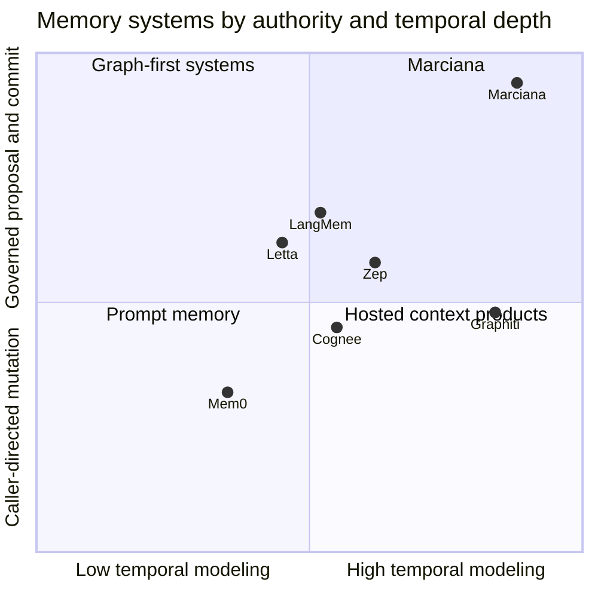
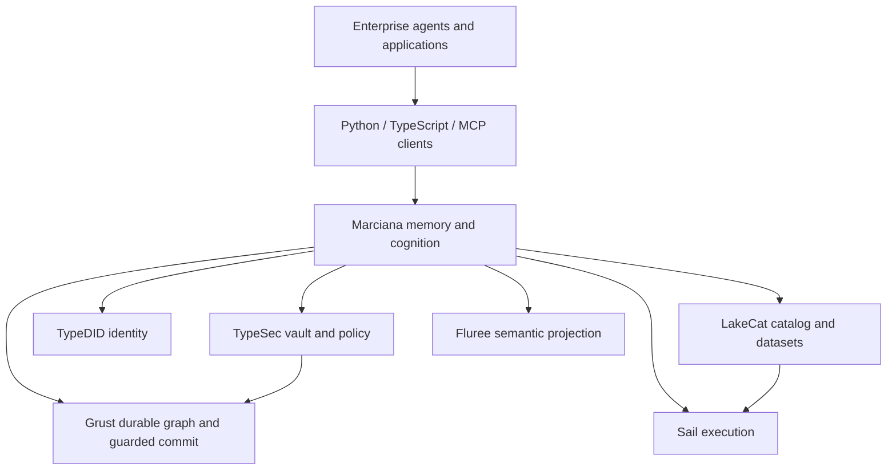
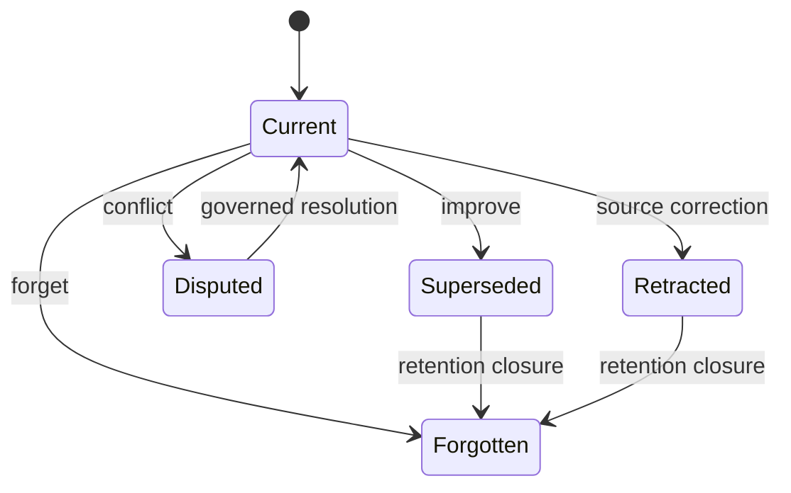
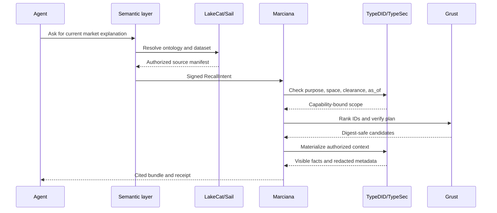

% Marciana
% Alexy Khrabrov
% First Pair Press, 2026

# Preface: Memory is an agreement

An agent that remembers is not merely a model with a longer prompt. It is a
system that makes claims about the world, keeps those claims over time,
decides who may see them, and changes them without losing the reasons they
changed. That is a database problem, a security problem, a semantic problem,
and an operational problem before it is a prompt-engineering problem.

Marciana is a governed memory system for the QueryGraph stack. Its central
promise is modest and demanding: memory formation may be creative, but memory
mutation is authoritative only at a capability-bound commit boundary. The
system can learn from an agent, a document, a graph query, or a semantic
pipeline; none of those sources gets to smuggle an unverified write into the
ledger.

This book explains the design from first principles and then follows a memory
event through the stack. It compares Marciana with Mem0, Graphiti, Zep,
Cognee, Letta, and LangMem; describes the Rust implementation and its Python
surface; walks through benchmarks and a Honduras coffee-market example; and
places Marciana beside the other QueryGraph repositories. The final chapters
look forward to ontology-driven cognition and a possible Apache Ossie
integration aligned with the semantic Croissant vocabulary.

The word *possible* matters in that last sentence. Marciana's ledger,
TypeSec boundary, Grust projections, Sail integration, and benchmark harness
are implemented. Ossie is treated here as an emerging interoperability target:
an architectural fit to be verified against its released specification, not a
claim that an unconfirmed external feature already exists.

## How to read this book

Readers who build agents can begin with Chapters 1, 3, and 11. Readers who
operate data platforms should start with Chapters 4, 6, and 13. Readers who
want the Rust contracts can read Chapters 5–10 with the source tree open. Each
chapter names its boundary: what the layer owns, what it must never own, and
what evidence crosses the boundary.

# Part I — The memory problem

## 1. From context windows to durable belief

### 1.1 A prompt is not a memory

A context window is a temporary working set. It can contain a user message,
retrieved documents, tool results, system instructions, and generated
intermediate text. It is useful precisely because it is disposable. Memory is
different: memory survives a turn, may be consulted by another process, and
can influence a consequential decision later.

The distinction can be stated as a state-transition equation:

$$
S_{t+1} = \operatorname{commit}(S_t,\; \operatorname{authorize}(\operatorname{propose}(E_t)))
$$

where $S_t$ is durable state, $E_t$ is evidence available at time $t$, and
the proposal is not itself a commit. The separation prevents a language model
from becoming an implicit database administrator.

| Layer | Question | Failure if omitted |
| --- | --- | --- |
| Evidence | What was observed, and from where? | Plausible fiction becomes a fact |
| Identity | Which exact memory or assertion is this? | Updates collide or delete the wrong item |
| Time | When was it true, and as of when was it known? | Historical truth is rewritten as current truth |
| Policy | Who may use it for what purpose? | Cross-tenant or sensitive leakage |
| Proposal | What change does cognition suggest? | Model output becomes authority |
| Commit | Which authorized mutation actually happened? | No recovery, audit, or idempotency |

### 1.2 The four memory verbs

Marciana begins with four verbs rather than a large surface of framework
adapters:

1. **Remember** creates an authored or derived item with source lineage.
2. **Recall** selects authorized items for a purpose and a time boundary.
3. **Improve** creates a replacement while retaining historical state.
4. **Forget** performs a scoped, receipt-producing lifecycle transition.

The verbs are deliberately ordinary. Their unusual property is that every one
enters the same TypeSec-controlled vault and the same guarded mutation seam.
Vector search, graph traversal, semantic extraction, and agent tools are ways
to propose or rank; they are not alternate verbs.

### 1.3 Memory as a typed claim

A useful minimum model is:

```text
MemoryFact = {
  id, subject, predicate, object,
  source, observed_at, valid_from, valid_until,
  confidence, label, lifecycle_state
}
```

The `id` is not a display label. It is a durable identity derived through the
ledger's canonical rules. `observed_at` describes evidence time; validity
intervals describe the claim's temporal meaning. `confidence` is a typed value,
not a sentence such as “the model felt sure.” `label` participates in
information-flow policy. `lifecycle_state` distinguishes current,
superseded, disputed, retracted, quarantined, and forgotten states.

### 1.4 The memory budget is multidimensional

Teams often optimize only token count. A governed system must budget at least
five resources:

| Budget | Example unit | Why it matters |
| --- | --- | --- |
| Context | tokens or bytes | Model cost and attention dilution |
| Formation | source/output records | Blast radius of cognition |
| Authority | capability uses | Prevents unbounded mutation |
| Retention | days or trajectory events | Limits historical exposure |
| Operations | microcredits and latency | Makes the product operable |

The planner therefore returns a deterministic plan before the vault returns
bytes. The plan is an object that can be hashed, evaluated, and authorized.

## 2. First principles of governed memory

### 2.1 Identity before intelligence

An intelligent extractor cannot repair an ambiguous identity. If two price
observations share a structural triplet but come from different episodes, they
must not silently collapse. Marciana's assertion identity includes collision-
resistant canonical material and bounded source lineage. A retry produces the
same identity; a genuinely distinct observation produces a different one.

### 2.2 Provenance is a graph, not a string

“Source: Dataverse” is useful metadata but insufficient evidence. A durable
lineage records the path from an input record through a TypeDID-authenticated
request, a governed scan, a proposal, an authorization decision, and a commit
receipt. Marciana exports this path as digest-only lineage when the viewer is
not authorized for content.


The graph is inspectable without turning an audit endpoint into a side channel.
Nodes carry identities and digests; protected text remains behind the vault.

### 2.3 Time has two axes

An observation can be valid for a market interval and become known to the
system later. Recall must answer both “what was true on date X?” and “what did
the system know at date Y?” Marciana's context bundle carries an `as_of`
qualifier, and its plan, citations, explanations, and renderers bind to the
same cutoff.

| Query | Validity interval | Knowledge cutoff |
| --- | --- | --- |
| Current price | open at present | now |
| Historical price | 2026-01-01 | now |
| Reconstructed report | 2026-01-01 | 2026-01-15 |

Without both axes, an improved memory can accidentally become a time machine.

### 2.4 Authorization is a data-flow property

Security is not a final `if` statement. A sensitive memory can leak through a
summary, a ranking score, an explanation, an embedding, or an error message.
Marciana's policy is therefore information-flow oriented: every byte returned
by context materialization traces to an authorized item, and redacted
candidates render only bounded metadata.

### 2.5 Mutation must be boring

The proposal engine may be sophisticated. The commit engine should be boring:
validate the exact request digest, verify freshness and capability, check
labels and quotas, apply an idempotent guarded mutation, and return a receipt.
The boring boundary is what makes retries, crashes, and audits tractable.

# Part II — The landscape

## 3. Comparative systems review

The comparison in `MARCIANA2.md` is architectural rather than a leaderboard.
Products evolve quickly, and their reported scores depend on models, prompts,
judges, data preparation, and hosting choices. The useful question is what
each system teaches Marciana without redefining Marciana's authority model.

| System | Strong idea | Boundary Marciana keeps |
| --- | --- | --- |
| Mem0 | Simple add/update/delete memory experience | Four native verbs still pass TypeSec and preserve lineage |
| Graphiti | Temporal assertion graph and episode ingestion | Temporal identity is ledger-owned, not an unguarded graph write |
| Zep | Prompt-ready context as an operated product | Context is a verified plan plus vault materialization |
| Cognee | Composable ingestion and retrieval pipelines | Stores are Grust projections; no Cognee runtime or facade |
| Letta | Memory blocks as durable agent state | Agent state cannot mint capabilities or bypass policy |
| LangMem | Hot-path versus background learning and prompt optimization | Cognition creates versioned proposals, never direct activation |

### 3.1 Mem0: ease of formation

Mem0 demonstrates that developers want an ergonomic “remember this” operation.
Its add/update/delete vocabulary makes memory approachable. Marciana adopts
the usability lesson but makes the authority path explicit: a caller creates a
typed request; TypeDID authenticates its origin; TypeSec checks purpose,
clearance, retention, and space; Grust commits atomically.

### 3.2 Graphiti: time and contradiction

Graphiti foregrounds temporal facts and graph relationships. Marciana agrees
that memory is not a bag of vectors. The ledger therefore represents
assertions, source lineage, validity intervals, and conflict states before
forming richer projections. A graph edge is a useful projection only when its
assertion identity and historical status remain recoverable.

### 3.3 Zep: context as a product

Zep makes context assembly visible as a product surface. Marciana's planner
follows this insight: retrieval is not the same as injection. The planner
selects candidate IDs and estimates tokens; only a capability-bound
materializer can reveal content. This makes a context bundle testable without
shipping a protected fixture into a benchmark report.

### 3.4 Cognee: pipelines without a second store universe

Cognee's adapters and pipelines show how ingestion can be composed. An
adapter translates an external source into a pipeline's expected shape; a
pipeline extracts, enriches, and indexes; a search surface assembles results.
Marciana takes the compositional idea and rejects the runtime dependency and
store proliferation. Grust already provides the durable store and guarded
commit protocol. LakeCat provides catalog and data-platform boundaries. A
Marciana adapter should be a thin translator into a formation profile, not a
parallel Cognee compatibility layer.

### 3.5 Letta and LangMem: learning with restraint

Letta makes memory part of agent state; LangMem distinguishes background
learning from hot-path adaptation. Marciana adopts both ideas as proposals:
working sets are bounded, procedures are versioned, evaluations unlock
activation, and rollback remains possible. An agent can suggest a procedure;
it cannot publish one by writing to its own prompt.

### 3.6 The decision

Marciana's differentiated product is not “all memory features.” It is a
coherent trust kernel plus a small context-and-learning product:



The diagram is a design map, not a scientific ranking. It highlights the
combination Marciana optimizes: temporal, provenance-rich state and a strict
proposal/commit split.

# Part III — The QueryGraph stack

## 4. Where Marciana lives

QueryGraph is a stack, not a single database. Each layer has a narrow contract:

| Layer | Owns | Must not own |
| --- | --- | --- |
| TypeDID | Agent identity and signed request provenance | Memory content or policy decisions |
| TypeSec | Capabilities, labels, vault authorization | Retrieval ranking or model prompts |
| Grust | Durable graph/storage, leases, guarded idempotency | Semantic truth or model choice |
| LakeCat | Catalog, datasets, governance metadata | Agent authority or memory mutation |
| Sail | Distributed relational/semantic execution | Private memory policy |
| Fluree | Semantic ledger/query projection where deployed | TypeSec capability minting |
| Marciana | Memory verbs, cognition proposals, context products | Foundational stores or generic Sail behavior |
| Agents/clients | Translation, orchestration, user experience | Reimplementing authorization |



### 4.1 The code-boundary rule

At every boundary, a caller should see a typed request and a typed receipt,
not a borrowed store handle. The rule can be summarized as:

```rust
pub trait MemoryBoundary {
    fn remember(&self, request: RememberRequest) -> Result<Receipt, Error>;
    fn recall(&self, request: RecallRequest) -> Result<RecallBundle, Error>;
    fn improve(&self, request: ImproveRequest) -> Result<Receipt, Error>;
    fn forget(&self, request: ForgetRequest) -> Result<Receipt, Error>;
}
```

The trait is conceptual; the concrete implementation routes through TypeSec's
capability-bound vault and the existing guarded cognition commit path. A client
does not receive a Grust transaction or a Sail session as a substitute.

## 5. TypeDID and TypeSec: identity before memory

TypeDID supplies a durable identity for the agent or service making a request.
The signed request carries the operation, target space, purpose, profile, and a
request digest. A signature answers “who asked?” It does not answer “may this
identity do that?”

TypeSec answers the second question. Its vault gate checks capability, purpose,
space, clearance, validity, retention, quarantine, and information-flow label.
Only after that check can protected source material be materialized or a
governed draft be bound to a commit.

```python
request = RememberRequest(
    space="coffee-honduras",
    purpose="market-research",
    source_id="dataverse:coffee:2026-01-10:sps",
    draft=MemoryDraft(text="4.20 USD/kg", label="internal"),
)
receipt = client.remember(request)
assert receipt.operation == "remember"
```

The Python client validates the wire shape and delegates signing,
authorization, and storage to an injected transport. This keeps SDK code thin
and makes it impossible for a convenience adapter to become a hidden policy
engine.

## 6. Grust, LakeCat, Sail, and Fluree

### 6.1 Grust: the durable substrate

Grust supplies the durable scheduler/store semantics Marciana needs: leases,
guarded idempotency, recovery, and ID-only outbox behavior. The ledger lowers a
validated assertion into inert graph mutations. The guarded commit accepts the
mutation only after TypeSec has authorized the exact draft.

```rust
let plan = ledger.lower_assertion(assertion)?;
let receipt = vault.authorize_and_commit(
    capability,
    request_digest,
    plan,
)?;
```

Neither `plan` nor `receipt` carries arbitrary protected text into an audit
stream. The durable identity and evidence digest are enough to reconcile a
retry.

### 6.2 LakeCat: catalog, not memory authority

LakeCat names datasets, schemas, ownership, and governance metadata. In the
coffee example, a Dataverse-shaped file is loaded into a table and associated
with a source identity. LakeCat tells the system which dataset is authoritative
for a domain; it does not decide which agent may remember a row.

```python
dataset = lakecat.catalog.resolve("agstack/coffee/honduras")
rows = dataset.scan(as_of=date(2026, 2, 10), columns=SAFE_COLUMNS)
proposal = marciana.form(dataset.source_id, rows, profile="document-deduplication-v1")
```

### 6.3 Sail: execution plane

Sail can run relational and semantic queries over distributed data. Marciana
uses it as an execution endpoint and keeps Sail-specific behavior upstream.
The integration boundary is a query plan, table identity, and bounded result
manifest—not a private fork of Sail.

```python
warehouse = SailWarehouse(os.getenv("SAIL_SPARK_CONNECT_URL"))
warehouse.load(coffee_rows)
rows = warehouse.query(
    "SELECT market, price_usd_per_kg, observed_on "
    "FROM coffee_honduras ORDER BY observed_on"
)
```

The supported baseline records the merged upstream Sail PR #2374 revision in
`compat/sail-revision.txt`. The explicit binary remains subject to the live
gate; a random executable on `PATH` is not proof of compatibility.

### 6.4 Fluree: semantic projection

Fluree can provide a semantic ledger and query surface for graph-shaped data.
Marciana's rule is projection, not duplication: the memory ledger remains the
logical authority, while a Fluree view may answer semantic queries or feed a
formation proposal. A projection must carry the source assertion IDs and
revision so it can be rebuilt and compared.

# Part IV — The memory engine

## 7. The assertion ledger

The ledger is the first durable product. It solves the problem that a graph
edge alone cannot solve: two claims can share a subject, predicate, and object
shape yet differ in source episode, observation time, confidence, or lifecycle.

### 7.1 Structural migration

Legacy `RELATES` edges are migrated into explicit assertions through a
retry-stable conversion. The migration runner applies only validated
projections in one idempotent backend batch under deployment migration
authority. Mixed-version reads remain compatible while the new assertion
projection is built.

| Migration property | Guarantee |
| --- | --- |
| Retry | Same legacy edge yields same assertion identity |
| Collision | Distinct source lineage remains distinct |
| Rollback | No partial batch becomes visible |
| Reopen | Durable IDs survive database close/reopen |
| Read compatibility | Baseline neighborhood behavior remains available |

### 7.2 Lifecycle states



A state transition carries a canonical causal assertion identifier and an
evidence digest. “Forget” does not mean pretending the event never existed;
the system records a bounded lifecycle transition while preventing ordinary
recall from returning the forgotten content.

## 8. Formation and cognition

Cognition is a proposal engine. It reads authorized source material, selects a
closed profile, asks a trusted provider to produce bounded output, and emits
an inert proposal. The application rechecks the profile, source/output ceilings,
authority freshness, and labels before commit.

### 8.1 Closed profiles

Profiles such as `background-deduplication-v1`,
`conversation-deduplication-v1`, `document-deduplication-v1`,
`json-event-reconciliation-v1`, and `raw-deduplication-v1` select exactly one
native cognition operation. A payload cannot name a new executor or operation.

| Profile field | Purpose |
| --- | --- |
| Profile ID/version | Reproducible behavior |
| Run mode | Background or opt-in hot-path proposal |
| Provider binding | Trusted model/executor identity |
| Source ceiling | Bounded input records |
| Output ceiling | Bounded proposal records |
| Schema versions | Stable wire interpretation |

### 8.2 Durable progress

Job progress is lease-bound, monotonic, and bounded. It stores optional digest-
only detail identities rather than worker text or model output. Restart and
lost-response tests prove exactly-once authoritative outcomes without requiring
exactly-once model inference.

```rust
pub struct FormationProgress {
    pub phase: FormationPhase,
    pub completed: u32,
    pub considered: u32,
    pub detail_digests: Vec<Digest>,
}
```

The distinction is crucial: inference may be repeated; the commit identity may
not be duplicated.

## 9. Governed context

Recall is a compiler pipeline:

1. Build a `RecallIntent` from caller purpose, space, policy, and time.
2. Rank digest-safe candidate IDs through a versioned recipe.
3. Plan a bounded selection without materializing content.
4. Verify the plan digest and candidate set.
5. Ask TypeSec to materialize authorized bytes.
6. Return a bundle with citations, redactions, token accounting, and receipt.


The planner is pure and content-free. Equivalent recall paths pass the same
visibility corpus; unauthorized candidates cannot leak through scores,
summaries, or explanations.

### 9.1 Typed bundles

A context bundle separates semantic sections while retaining one receipt:

```text
ContextBundle {
  episodic: [Citation]
  semantic: [Citation]
  procedural: [Citation]
  profile: [Citation]
  redacted: [RedactedMetadata]
  plan_digest
  materialization_digest
  as_of
  selected_token_estimate
}
```

Sessions and threads add product metadata—space and recall-policy identity—
but do not create authorization namespaces. A thread cannot widen a
capability merely by having a new name.

# Part V — Enterprise semantics

## 10. Marciana in the enterprise semantic layer

Enterprise agents do not live in a single application database. They move
between CRM records, lakehouse tables, catalog entries, policy systems,
documents, and operational APIs. A semantic layer makes those systems
discoverable by concepts and relationships, but semantic discoverability is not
permission to disclose or mutate.

### 10.1 A reference workflow



The semantic layer supplies names and relationships. Marciana supplies durable
memory semantics. TypeSec supplies authority. This division lets an enterprise
change its catalog or query engine without changing the memory trust contract.

### 10.2 Agent roles

The enterprise deployment should distinguish at least four roles:

| Role | Can do | Cannot do |
| --- | --- | --- |
| Research agent | Recall and propose observations | Commit arbitrary memory |
| Steward | Review proposals and quarantine | Bypass labels or retention |
| Operator | Run migrations, quotas, backups | Read protected content by default |
| Auditor | Inspect digests and receipts | Recover plaintext from hashes |

This is a better fit for regulated organizations than a single super-agent
with an all-purpose database token.

### 10.3 Cost and SLOs

The cognition layer exposes bounded metrics and integer microcredit estimates.
Operation metrics carry verb counts, denials, and latency accounting. SLO
evaluation reports per-verb latency and denial-rate targets without exporting
request or memory content. This supports a semantic layer that is accountable
to procurement and operations rather than only to a demo notebook.

## 11. Ontologies, semantic Croissant, and Apache Ossie

### 11.1 Why ontologies belong before extraction

An extractor that sees “price,” “value,” and “USD/kg” as unrelated strings will
produce unstable memory. An ontology registry declares typed fields, edges,
identity rules, and permissible schema windows before formation runs. The
registry is operator-owned, canonicalized, resolved by exact identity, and
digest-bound to the proposal.

```text
CoffeeObservation
  ├── crop: skos:Concept = coffee
  ├── country: geo:Country = Honduras
  ├── market: qg:Market
  ├── price: schema:QuantitativeValue (USD / kg)
  ├── observedOn: xsd:date
  └── source: prov:Entity
```

### 11.2 Croissant alignment

The semantic Croissant vocabulary is useful as an interchange description for
datasets, fields, distributions, and their relationships. Marciana can map a
Croissant dataset description to a LakeCat source manifest and then to a
formation profile. The mapping must preserve source identity, schema revision,
license/usage constraints, and the as-of boundary.

| Croissant-facing concept | Marciana boundary |
| --- | --- |
| Dataset/resource | LakeCat source manifest |
| Field/schema | Ontology registry declaration |
| Record/instance | Ledger assertion candidate |
| Relation | Typed assertion edge |
| Distribution | Sail/warehouse adapter |
| Provenance | Digest-only lineage graph |

### 11.3 Apache Ossie as a future adapter target

If the new Apache Ossie project provides an ontology-aware semantic execution
or cognition surface aligned with Croissant, it is a natural peer integration:
Ossie can resolve concepts and transformations; Marciana can govern memory
formation and context. The safe adapter shape is:


The adapter must not import Ossie's store as Marciana's authority, accept
model-chosen operations, or bypass TypeSec. It should translate typed ontology
IDs, schema versions, source manifests, and bounded result sets. Until Ossie's
released contracts are verified, this chapter is an integration design and a
test plan—not a compatibility claim.

### 11.4 Ontology-aware cognition

Ontology-aware formation can improve precision without making the ontology a
permission system. A profile may require that `price` has a unit, `observedOn`
has a timezone policy, and `market` resolves to a registered entity. The
proposal still goes through source ceilings, output validation, labels,
freshness, and guarded commit.

# Part VI — Evidence and examples

## 12. Benchmarking memory systems

Marciana benchmarks memory as a product and a safety boundary. The local smoke
harness is dependency-free and intentionally small; external adapters are
pinned but optional. It measures correctness, abstention, redaction, token
utility, and latency rather than celebrating a single retrieval score.

### 12.1 Current verified run

| Measurement | Linear | Indexed |
| --- | ---: | ---: |
| Cases | 5 | 5 |
| Accuracy | 100% | 100% |
| Redaction leaks | 0 | 0 |
| Mean context tokens | 4.8 | 4.8 |
| P50 | 572.52 µs | 7.03 µs |
| P95 | 580.19 µs | 9.64 µs |
| P99 | 580.19 µs | 9.64 µs |

The run used 504 records and 1,000 repeats. Indexed lookup was approximately
81.44× faster at P50. The result is a regression signal, not a claim that a
local in-memory index beats every hosted vendor under every workload.

### 12.2 Vendor comparisons with discipline

Mem0 and Zep publish reference results for LoCoMo, LongMemEval, and BEAM.
Those numbers are informative but not directly comparable without matching
dataset revision, model, embedding, prompt, judge, hardware, cache, and token
policy. Marciana's report therefore requires provider-neutral metadata:

```json
{
  "model": "reference-smoke-v1",
  "provider": "local",
  "embedding": "none",
  "prompt": "none",
  "profile": "smoke-v1",
  "hardware": "Darwin-25.2.0-arm64-arm-64bit-Mach-O",
  "revision": "working-tree"
}
```

### 12.3 The real release corpus

The smoke test is not enough for release. The governed corpus should include
temporal updates, contradictions, supersession, deletion closure, poisoned
memory rejection, cross-tenant leakage, multi-hop citation precision,
procedure regression, crash recovery, index convergence, and stale proposal
rejection. Every result must remain content-free outside its authorized
environment.

## 13. A coffee-market walk-through

The example follows an agricultural research agent studying Honduras coffee.
The source is a Dataverse-shaped fixture based on the Palefire/AgStack style:
structured observations, provenance, a market entity, and a time-varying price.
The example is deliberately small enough to run locally while showing the
whole boundary chain.

### 13.1 Typed rows

```python
class CoffeeRow(BaseModel):
    observation_id: str
    country: str = "Honduras"
    commodity: str = "coffee"
    market: str
    price_usd_per_kg: float | None = Field(default=None, ge=0)
    observed_on: date
    source: str
    note: str = ""
```

The row is not yet a memory. It is source evidence. A formation profile or
typed agent tool can propose a `MemoryFact` after validation.

### 13.2 Dataverse to Sail

```python
rows = DataverseClient(dataset_url, fixture_path).rows()
loaded = sail.load(rows)
report = DataverseLoadReport(
    dataset_url=dataset_url or "urn:fixture:coffee-honduras",
    row_count=len(rows),
    source_file="coffee_honduras.csv",
    table_name=sail.table_name,
    sail_loaded=loaded,
)
```

The report makes the data movement observable without embedding a secret or
pretending that a local fixture is a production Dataverse connection.

### 13.3 Pydantic AI v2 tools

```python
agent = Agent(
    model or TestModel(call_tools=[]),
    deps_type=AgentDeps,
    output_type=AgentDecision,
    instructions=(
        "Use only tool results, cite source IDs, preserve historical prices, "
        "and never invent a market fact."
    ),
)
```

The tool definitions call `memory.remember`, `memory.recall`,
`memory.improve`, and `memory.forget`. They append receipts to an operation log
so a test can verify what happened. The model does not receive a database
credential.

### 13.4 Remember, improve, forget

```python
learned = await tool_turn(agent, deps, "remember", "Remember the agronomic facts.")
price = await tool_turn(agent, deps, "remember", "Remember the current price.")
before = await tool_turn(agent, deps, "recall", "Recall Honduras coffee price.")
improved = await tool_turn(agent, deps, "improve", "Use the newest observation.")
after = await tool_turn(agent, deps, "recall", "Recall the improved price.")
forgotten = await tool_turn(agent, deps, "forget", "Forget the obsolete price.")
```

The deterministic test model still exercises the tool boundary. Its explicit
tool-to-action mapping makes the structured decision agree with the operation
that actually ran. The regression sequence is:

```text
report → learn → learn → recall → improve → recall → forget
```

This is the small example that proves a large idea: cognition may revise a
belief, but revision remains historical, scoped, and receipt-producing.

# Part VII — Operating the system

## 14. Failure, recovery, and deletion

The production test matrix is as important as the happy path. A memory system
must answer what happens when a provider times out after proposing a draft,
when a worker lease expires, when authority is revoked between planning and
commit, or when an index is half rebuilt.

| Failure | Required behavior |
| --- | --- |
| Provider timeout | Retry proposal within bounded policy; no partial commit |
| Lost response | Idempotent commit returns the same receipt |
| Revoked authority | Fresh authorization fails closed |
| Label mismatch | Proposal rejected before materialization |
| Stale source | Proposal rejected or quarantined by policy |
| Index failure | Ledger remains authoritative; repair is ID-only and bounded |
| Forget request | Lifecycle transition closes recall visibility |
| Restore | Schema window and key boundary verified before reopen |

Backups contain manifests and digests, not an accidental second memory
authority. Encryption boundaries bind tenant identity, non-secret key identity,
and monotonic key revision while key material stays deployment-owned.

## 15. Building a disciplined adapter ecosystem

An adapter is healthy when it is small. It should translate a foreign request
into a Marciana intent, pass it to the native boundary, and translate the
receipt back. It should not duplicate:

- authorization and label checks;
- assertion identity or temporal conflict logic;
- formation retry and lease semantics;
- vector-index persistence;
- context token accounting; or
- backup, audit, and quota policy.

This is why Cognee remains inspiration rather than a dependency, and why
future MCP, LangGraph, Letta, Ossie, or Croissant adapters belong at the edge.

```python
class MemoryToolRegistry:
    def remember(self, payload: dict) -> dict:
        request = RememberRequest.model_validate(payload)
        return self.transport.execute("remember", request.model_dump())
```

The registry validates and dispatches. The injected transport owns the trust
boundary. The same principle applies to the TypeScript client and MCP tool
surface.

## 16. A release checklist

Before a release candidate:

1. Verify route, wire, durable-ID, database reopen, denial, receipt, and
   recovery compatibility.
2. Run all Rust tests, strict Clippy, client tests, benchmark tests, and the
   coffee demo in a clean environment.
3. Build the explicit pinned Sail revision and run its live gate.
4. Recompute benchmark metadata and reject incomplete reports.
5. Compare context evaluation reports and latency percentiles to the prior
   release.
6. Run adversarial multi-tenant, purpose, clearance, quarantine, and inference
   leakage tests.
7. Build PDF, EPUB, HTML, and chapter artifacts through FirstPair; inspect
   rendered pages and validate links and metadata.
8. Commit and push the source handoff before any publisher dry-run.

The last step is not ceremony. A published artifact must identify the exact
source tree that produced it.

# Conclusion — Memory with a conscience

The future of agentic enterprise software is not a larger prompt stuffed with
unexamined facts. It is a semantic system in which evidence, identity, time,
authority, and explanation remain connected as data moves across services.

Marciana's contribution is to make memory a governed QueryGraph product. It
uses TypeDID for identity, TypeSec for authority, Grust for durable guarded
state, LakeCat for cataloged data, Sail and Fluree for execution and semantic
projection, and thin clients for agents. Cognition can be ambitious because
the commit boundary is conservative. Ontologies can be rich because they do
not become permission tokens. A future Ossie integration can be powerful
because its adapter can remain thin and its semantic plans can be verified.

The design is intentionally unglamorous at the point where trust matters:
typed requests, bounded plans, deterministic digests, explicit receipts, and
recoverable transitions. That is how an agent earns the right to remember.
